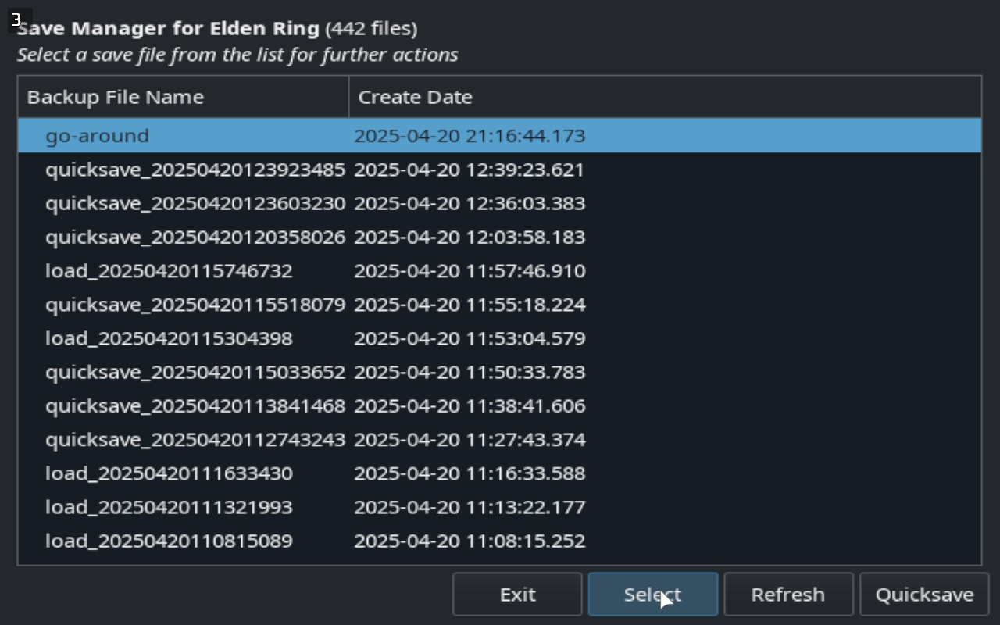
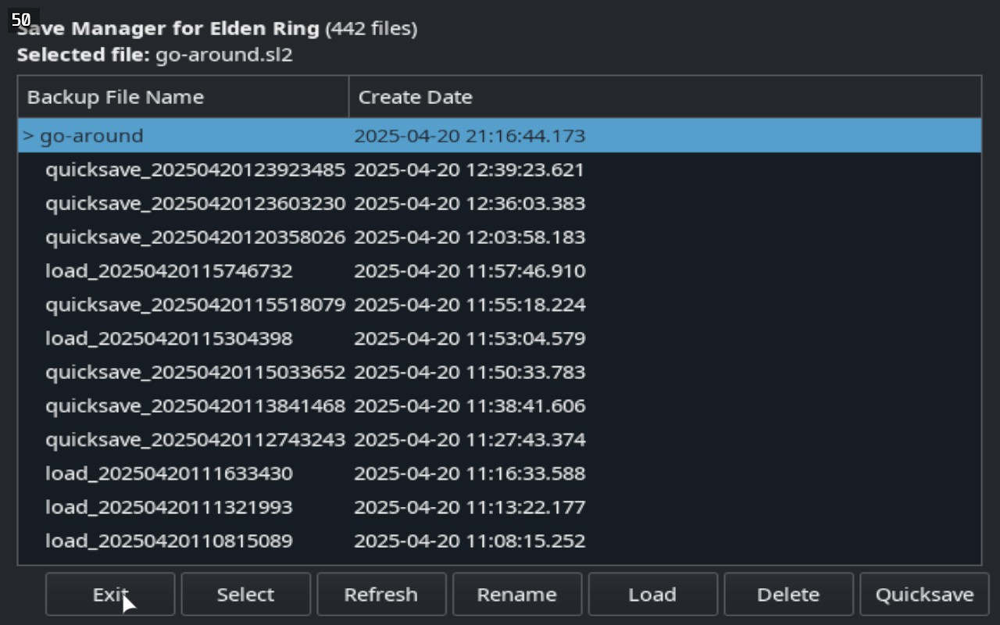
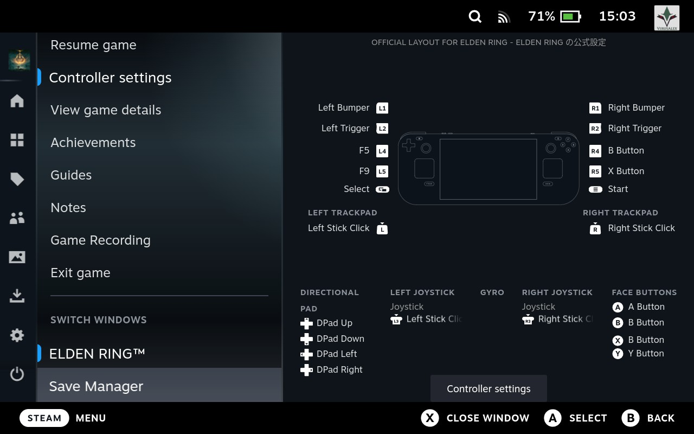

## Save Manager

Added Save Manager to provide an easy way to manage your Elden Ring save files:
- Create quicksaves at any time
- Rename and organize your saves
- Load previous save states
- Delete unwanted saves

All backup saves are stored in the `er_saves` directory in `ELDEN RING/Game/EldenProton` folder.

## Usage
- Place the `elden-proton.bash` into your preferred location and mark it as executable (`chmod +x` from shell)\
or just run
```bash
curl -s -o elden-proton.bash https://raw.githubusercontent.com/VirusAlex/elden-proton/refs/heads/master/elden-proton.bash && chmod +x elden-proton.bash && ./elden-proton.bash
```
- Set the provided launch options in steam for Elden Ring (see screenshot below)
- Launch Elden Ring from steam and select "Enable Save Manager" in the launcher UI




You may switch between the save manager and the game at any time through the Steam -> Switch Window.



The original README remains the same (with respect to [Cloudef](https://github.com/Cloudef/elden-proton))

# elden-proton

Noob friendly Elden Ring mod loader for linux/proton/steam


## Usage

- Place the `elden-proton.bash` into your preferred location and mark it as executable (`chmod +x` from shell).
- Run the script once through terminal or through graphical file manager to output steam launch options.
- Set the provided launch options in steam for Elden Ring
- Launch Elden Ring from steam and customize settings to your liking

## Flatpak Steam

- Make sure that every necessary path (wherever you put `elden-proton.bash` or the folder containing your Modengine2 mods) is accessible from the flatpak
- CLI example: `flatpak override com.valvesoftware.Steam --filesystem="$HOME/dev/personal:ro"` 
- Flatseal example: Put `"$HOME/dev/personal:ro"` under Filesystem->Other files for the Steam application
- Apart from that it should work out of the box

## Features

- Run Elden Ring modded or unmodded easily
- Zenity based GUI
- Automatically manages EldenModLoader and ModEngine2-proton
- Automatically manages and downloads popular DLL mods
- Easy access to DLL mod configuration files
- Run ModEngine2 compatible mods simply by choosing the mod directory

## Modengine2 mods

Many mods in NexusMods come with ModEngine2 bundled. Simply choose any folder that contains a `config_eldenring.toml` file and you are all set.

## Env variables

- `STEAM_PATH` control where steam is located
- `ER_PATH` control where `Elden Ring/Game` is located

## Start from scratch

In your `Elden Ring/Game` location, remove the `mods` and `EldenProton` folders. 
Remove only the `EldenProton` folder if you want to reset state and re-download everything.
Note that all DLL mod settings will be reset.
